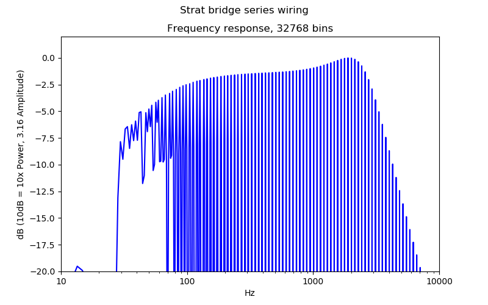

# Electric Guitar Pickup Testing

This contains artifacts related to measurements of electric guitar pickups using an inductor, digital audio interface, and test signal. The inductor is connected to the monitor output of the audio interface. A test signal of coherent sinusoids with amplitudes 1/f is generated and output by `audio_lab`. By Faraday's law, this induces a uniform comb input signal in the pickup. Then for linear systems, the peaks of the output signal is proportional to the frequency response of the system. This provides a convenient way to measure the pickups, or even the entire downstream system.

This is based on this excellent prior art. The inductor I used follows the directions of 2:

1. https://guitmod.wordpress.com/2016/09/26/diy-simple-measuring-of-a-pickups-frequency-response/
2. http://buildyourguitar.com/resources/lemme/

Live measurements can be taken and plots can be saved using `audio_lab.measurement.measure_pickup_frequency_response`. Or, the test signal can be exported and loaded using Audacity (see *.aup files).

A Scarlett 2i4 audio interface was used for all measurements. `scarlett-2i4-loopback-coherent.wav` contains the result of measuring the test signal directly. It matches the original test signal, so these direct measurements should be proportional to the pickup's frequency response.

The systems I measured:

- `les-paul`: A Les Paul Studio with Fishman Fluence Classic Humbuckers. `v1` is the PAF voice, `v2` is the hot-rod/hollowbody voice.
- `strat`: A Warmoth build with an alder VIP body, Wilkinson tremolo, roasted maple and rosewood neck, Seymour Duncan '59/Custom bridge, and SD Jazz neck. 
- `alnico-ii`: Seymour Duncan Alnico II bridge humbucker connected directly to the test signal.
- `tele`: American Professional telecaster.

This work was motivated by being unhappy with the sound of my strat. It sounded dull. You can see a peak around 2k for my bridge pickup wired in series:

Series humbuckers have double inductance and so half the peak frequency of single coils. SSS strats have peaks around 4k. I re-wired my strat so the humbucker coils are in parallel with each other, and this raised the peak frequency to 4-5k, which was consistent with reduced inductance:

Overall I much prefer this configuration, as it's easier to attenuate high-end rather than boost what's not there. Wiring the pickups in series can lead to a more compressed sound since the output is higher, which tends to drive amps harder. But a clean boost is trivial with modern gear so the pickup no longer needs to serve that purpose.

Additionally, I find the tone and volume controls more usable now. The tone control covers a more usable range, and the volume control retains more high end because the signal starts with more.